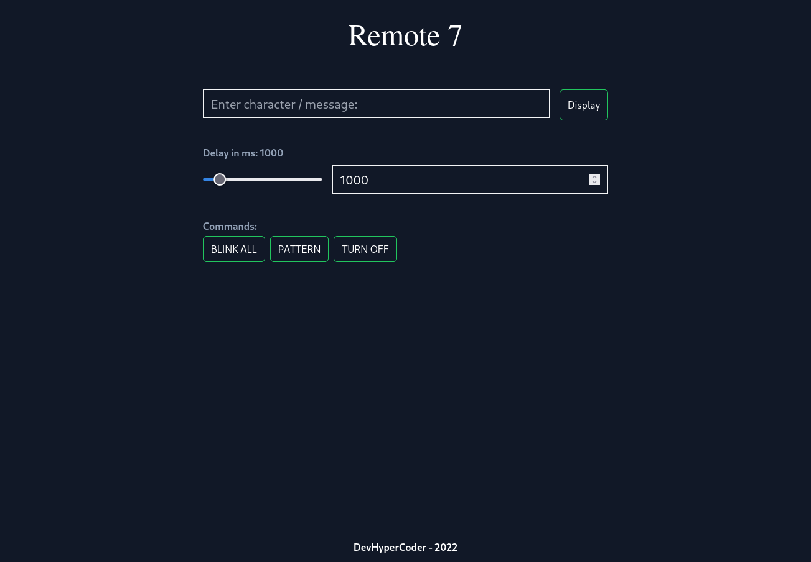

# Remote7 - Remotely control a 7 Segment display

This is a one-day project I made to tinker around with the Raspberry Pi and a 7
Segment display I had laying around.

# Usage

`remote7` is split into 2 parts.

## Frontend

> Requires [Node.js](https://nodejs.org/en/)

- Install dependencies: `npm install`
- Build: `npm run build`
- Host it on the raspberry pi.
- Proxy `/api` to the python backend server

## Backend

> Requires [Python](https://www.python.org/)
> `RPi.GPIO` is usually installed on the RPi

- Run the backend: `python main.py`

## Hardware

> 7 Segment display used is the CA (Common Anode) variant. If you are using a
> CC (Common Cathode) variant, you will need to make a slight change in main.py

- Connect the common anode to 3.3V via a 0.5 K resistor (2 `1K` resistors in parallel)
- Connect `a` - `g` of the 7 segment display to the RPi following the scheme
 [here](./CKT). Please refer to the pinout of the RPi. Use `pinout` for reference.

# Pictures

Website frontend:

# CREDITS

Lookup table: [Wikichip](https://en.wikichip.org/wiki/seven-segment_display/representing_letters)

# LICENSE

`remote7` is licensed under the GNU General Public License v3. A copy of the
license can be found [here](./LICENSE)
